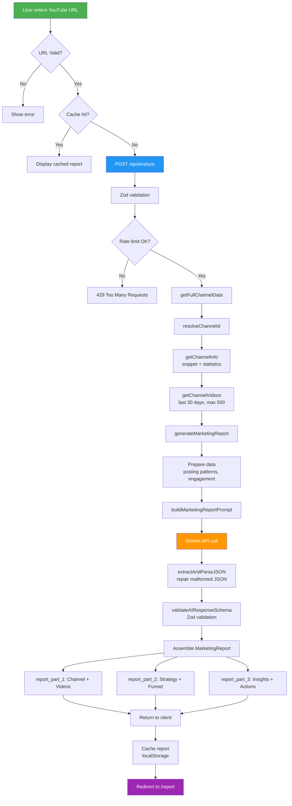
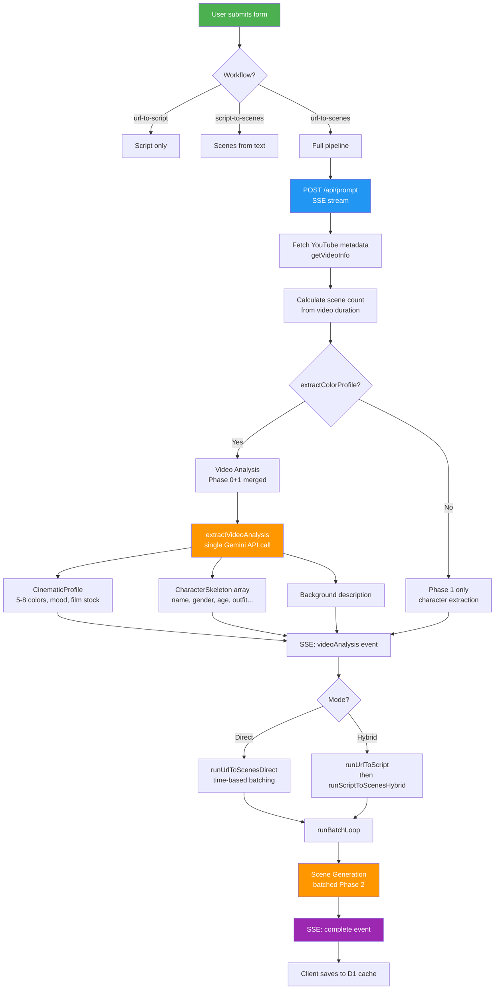
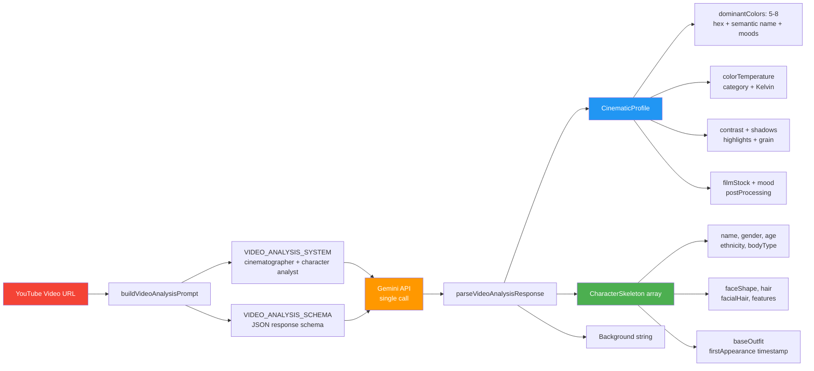
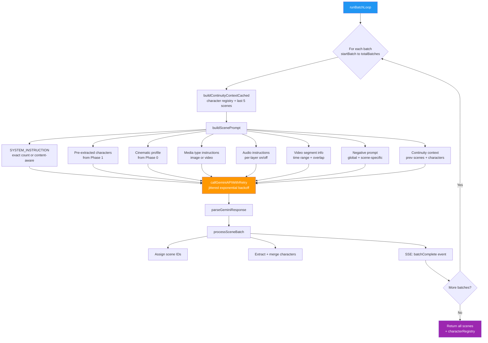
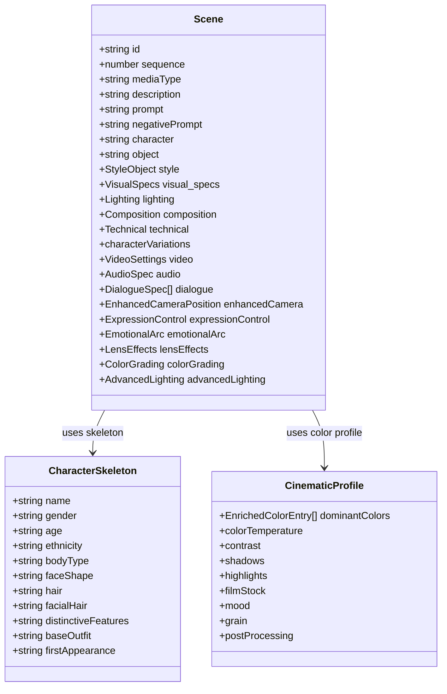
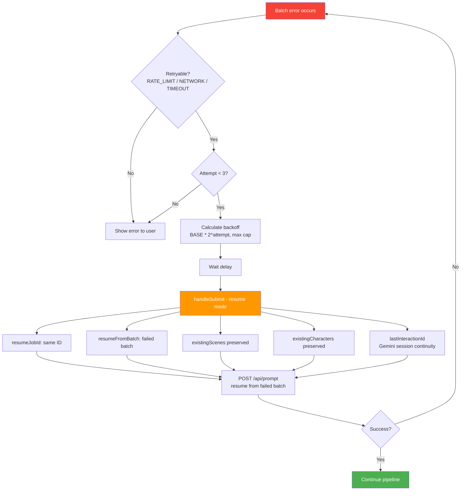
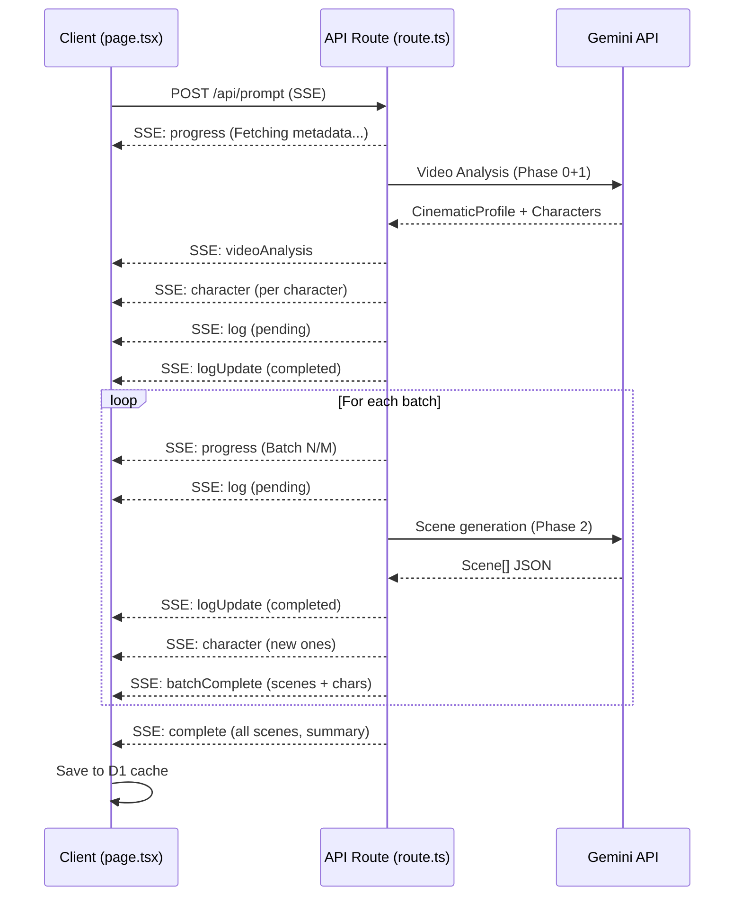
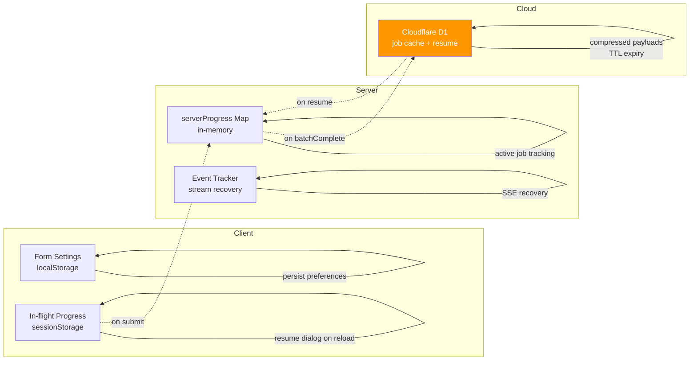

# Soi'Brand — Codebase Workflow

## Feature 1: YouTube Channel Analysis



### Key Files

| Layer | File | Purpose |
|-------|------|---------|
| UI | `app/page.tsx` | Home page, form submission |
| API | `app/api/analyze/route.ts` | Validation, orchestration |
| YouTube | `lib/youtube.ts` | Channel + video data fetch |
| AI | `lib/gemini.ts` | Marketing report generation |
| Prompt | `lib/prompts/marketing-report.ts` | AI prompt template |
| Cache | `lib/cache.ts` | localStorage TTL cache |

---

## Feature 2: Prompt/VEO Pipeline

### Overview



### Phase 0+1: Video Analysis (Merged)



### Phase 2: Batched Scene Generation



### Scene Output Structure



### Auto-Retry Flow



### SSE Event Flow



### Data Persistence



---

## Project Structure

```mermaid
flowchart TD
    subgraph Pages
        P1[app/page.tsx\nChannel Analysis]
        P2[app/prompt/page.tsx\nVEO Pipeline]
        P3[app/report/page.tsx\nReport Display]
    end

    subgraph API_Routes[API Routes]
        A1[/api/analyze\nChannel analysis]
        A2[/api/prompt\nScene generation SSE]
        A3[/api/prompt/jobs\nJob CRUD + recovery]
        A4[/api/quota\nAPI quota check]
    end

    subgraph Core_Lib[Core Libraries]
        L1[lib/youtube.ts\nYouTube Data API]
        L2[lib/gemini.ts\nGemini AI - reports]
        L3[lib/cache.ts\nlocalStorage cache]
        L4[lib/retry.ts\nexponential backoff]
        L5[lib/logger.ts\nstructured logging]
    end

    subgraph Prompt_Lib[Prompt Pipeline]
        PL1[lib/prompt/prompts.ts\nAll prompt templates]
        PL2[lib/prompt/gemini.ts\nGemini API + retry]
        PL3[lib/prompt/types.ts\nType definitions]
        PL4[lib/prompt/constants.ts\nMagic numbers]
        PL5[lib/prompt/api/workflows.ts\nWorkflow orchestration]
        PL6[lib/prompt/api/batch-runner.ts\nBatch loop]
        PL7[lib/prompt/interactions.ts\nGemini Interactions API]
        PL8[lib/prompt/cache-remote.ts\nD1 cloud cache]
    end

    P1 --> A1
    P2 --> A2
    P2 --> A3
    A1 --> L1 & L2
    A2 --> PL5
    PL5 --> PL1 & PL2 & PL6
    PL6 --> PL2
    PL2 --> PL7
    A2 --> PL8
    A3 --> PL8

    style P1 fill:#4CAF50,color:#fff
    style P2 fill:#4CAF50,color:#fff
    style A1 fill:#2196F3,color:#fff
    style A2 fill:#2196F3,color:#fff
    style PL1 fill:#FF9800,color:#fff
    style PL5 fill:#FF9800,color:#fff
